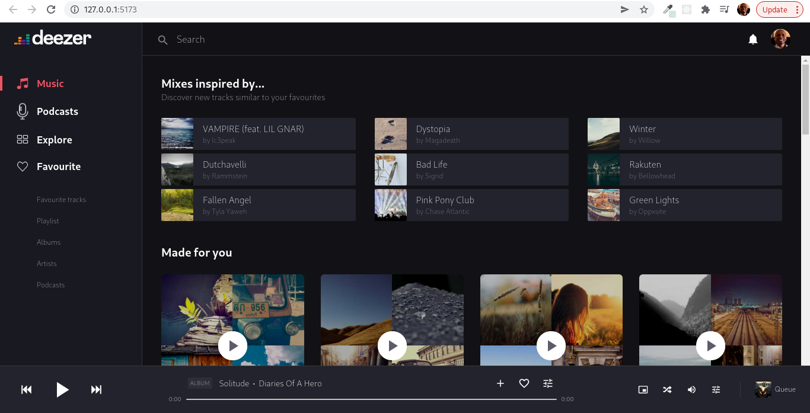
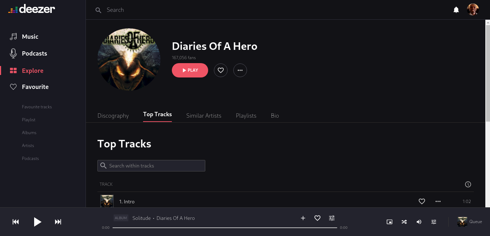
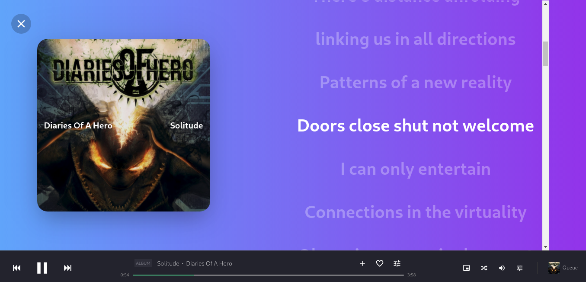
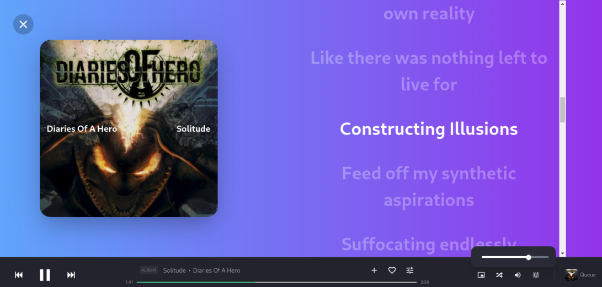
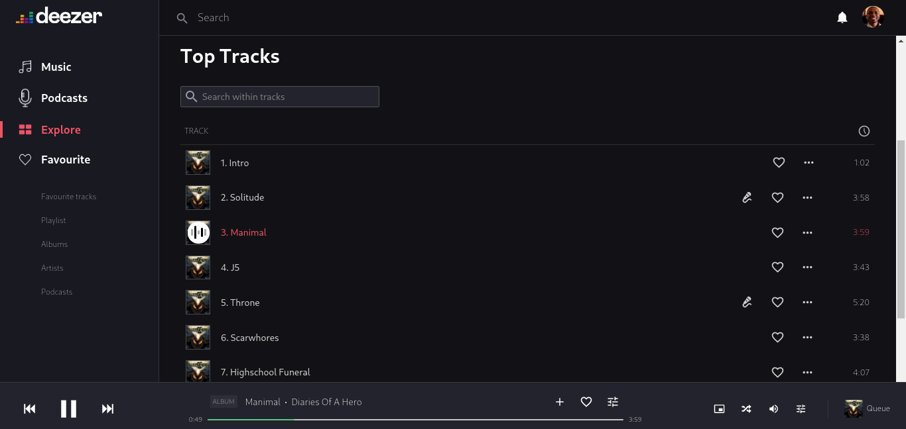

# Music Streaming Application

Hosted in Netlify see - [Music Streaming App](https://645e03e2814996717e8f7235--soft-palmier-d254ba.netlify.app)

This is a streaming application which takes after the notorious commercial Deezer player.
The aim is to demostrate playing music and lyrics

# Stack Used
- [Vue 3](https://vuejs.org)
- [Vite](https://vitejs.dev)
- [Pinia](https://pinia.vuejs.org)
- [TailwindCSS](https://tailwindcss.com)

### Features

- Below is a video overview of roughly how the application looks and the feature being demoed.

1. Home Page

2. Artist Album Page

3. Lyrics Autoscrolling and Song Playing

4. Music Volume Controller

5. Tracks Listing and Track Playing

